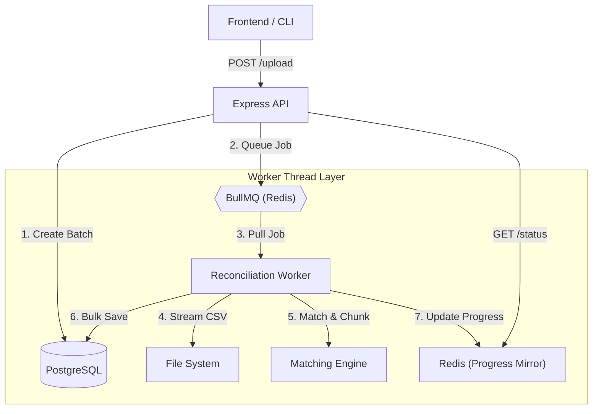

# Payment Reconciliation Engine — Backend

## Overview

This backend implements a **payment reconciliation engine** that automatically matches **bank transactions** with **invoices**, flags uncertain matches for **human review**, and provides **auditable admin controls** for final decisions.

The system is designed to be:

- **Conservative** — avoid false positives in financial data
- **Explainable** — every match can be justified
- **Scalable** — handles large CSV uploads efficiently
- **Auditable** — no silent or irreversible actions

The implementation strictly follows the requirements described in the **Round 2 BRD**.

---

## High-Level Architecture

The system follows a **decoupled, event-driven architecture** optimized for high-throughput reconciliation.



### System Components

#### 1. API Layer (Express)
Handles file uploads, batch creation, and provides real-time status updates. It acts as an orchestrator, delegating heavy work to the background layer.

#### 2. Background Processing (BullMQ + Redis)
The "Golden Standard" for reliability. BullMQ provides:
- **Persistence**: Jobs are saved to Redis, surviving server restarts.
- **Concurrency**: Offloads CPU-intensive matching to separate processes.
- **Retries**: Automatically handles transient failures (e.g., database lock contention).

#### 3. Scaling Strategy: Streaming & Chunking
To handle millions of rows:
- **Streaming Parser**: Files are read line-by-line using `fs.createReadStream`, maintaining $O(1)$ memory usage regardless of file size.
- **Chunked IO**: Transactions are processed and saved in batches of 1,000 using Prisma `createMany` for optimal database performance.

#### 4. Graceful Fallback
If Redis is unavailable, the system automatically detects this and falls back to **direct background processing** on the main thread. This ensures the service remains functional even during a Redis outage.

---

## Core Design Principles

### 1. Financial Safety First

In financial systems, **false positives are more dangerous than false negatives**.

Therefore:
- Only **very high confidence matches (≥ 95%)** are auto-matched
- Ambiguous cases are explicitly flagged for review
- Nothing is silently confirmed

This mirrors how real-world accounting and reconciliation systems behave.

---

### 2. Clear Separation of Concerns

Each layer has a single, well-defined responsibility:

| Layer | Responsibility |
|-----|---------------|
| API Layer | HTTP handling, validation, orchestration |
| Matching Engine | Pure scoring and decision logic |
| Worker | Background CSV processing |
| Redis | Performance optimization only |
| Database | Source of truth |
| Audit Logs | Immutable decision history |

This separation improves:
- Maintainability
- Testability
- Reasoning about correctness

---

## Technology Stack & Rationale

### Node.js + TypeScript
- Strong typing for financial data
- Safer refactoring and correctness
- Commonly used in production backends

---

### Express
- Minimal abstraction
- Predictable request lifecycle
- Easy to reason about and explain

---

### PostgreSQL (Primary Database)
Chosen for:
- ACID guarantees
- Strong indexing and query planning
- Suitability for financial and relational data

All **authoritative state** lives in PostgreSQL.

---

### Prisma ORM
- Type-safe database access
- Explicit schema modeling
- Safe migrations
- Easy to read and reason about

Business logic remains in services, not inside ORM abstractions.

---

### Redis (Infrastructure Support Layer)

Redis serves a dual purpose in this system:
1. **Persistent Job Queue (BullMQ)**: Ensures background reconciliation jobs are queued reliably and can survive server restarts.
2. **Performance Optimization**: Caches recently accessed invoices and mirrors batch progress for near-instant UI updates.

> **Resilience First**: While BullMQ is the preferred "Golden Standard", the system is designed with **graceful degradation**. If Redis is unavailable, the engine automatically falls back to in-process background processing, ensuring zero downtime.

---

## Data Model Design

### Invoice
Represents expected payments.

- Seeded once from CSV
- Paid invoices are excluded during matching
- Indexed on amount, status, and due date

---

### BankTransaction
Represents a single row from the bank CSV.

Stores:
- Match result
- Confidence score
- Detailed explanation of the match decision

Each transaction belongs to a reconciliation batch.

---

### ReconciliationBatch
Represents one CSV upload session.

Tracks:
- Total rows
- Processed rows
- Match counts by category
- Lifecycle status

This enables:
- Progress tracking
- Safe retries
- Admin visibility

---

### MatchAuditLog
An **immutable audit log** of every decision.

Each entry records:
- Previous and new invoice (if applicable)
- Action taken
- Who performed it (system or admin)
- Optional reason

This provides full traceability and safety.

---

## Matching Engine Design (Core Logic)

### Why a Pure Matching Engine?

The matching engine is:
- Pure
- Deterministic
- Side-effect free
- Unit-testable
- Framework-agnostic

It has:
- No database access
- No HTTP logic
- No shared state

This makes it easy to test, reason about, and evolve.

---

### Matching Strategy

#### 1. Amount-Based Filtering
Only invoices with **exact amount matches** are considered.

This drastically reduces false positives and search space.

---

#### 2. Name Normalization
Bank descriptions are noisy and inconsistent.

Normalization includes:
- Uppercasing
- Removing punctuation
- Removing noise words (PAYMENT, DEP, CHK, etc.)
- Collapsing whitespace

---

#### 3. Name Similarity (Primary Signal)
**Jaro–Winkler similarity** is used because:
- It is designed for short human names
- Handles reordered names well
- Tolerates initials and abbreviations

This performs better than Levenshtein for this domain.

---

#### 4. Date Proximity (Secondary Signal)
Payments closer to the invoice due date receive a small confidence boost.

---

#### 5. Ambiguity Penalty
If multiple invoices share the same amount:
- Confidence is penalized
- The system defers to human review

This avoids unsafe auto-matching.

---

### Confidence Thresholds

| Confidence | Outcome |
|-----------|--------|
| ≥ 95 | AUTO_MATCHED |
| 60–94 | NEEDS_REVIEW |
| < 60 | UNMATCHED |

These thresholds are intentionally conservative.

---

## Background Processing

### Why Background Processing?

CSV uploads may contain **up to 10,000 rows**.

Processing them synchronously would:
- Block HTTP requests
- Freeze the UI
- Risk timeouts

---

### Persistent Job Queue (BullMQ)

The system uses **BullMQ** for background job management because:
- **Scalability**: Can handle massive CSV files (up to millions of rows).
- **Isolation**: Processing runs in separate worker threads, keeping the API responsive.
- **Resilience**: Redis persistence ensures jobs are not lost if the process crashes.
- **Graceful Fallback**: If Redis is missing, the system falls back to a non-persistent in-process mode automatically.

---

### Streaming CSV Processing

CSV files are processed using **streams**, not loaded into memory.

Benefits:
- Constant memory usage
- Safe handling of large files
- Predictable performance

---

## Human-in-the-Loop Admin Actions

### Explicit Admin Control

System outcomes are **suggestions**, not final decisions.

Admins must explicitly:
- Confirm matches
- Reject matches
- Manually assign invoices
- Mark transactions as external

No action is silent or automatic.

---

### Status Lifecycle

| Type | Status |
|----|------|
| System | AUTO_MATCHED, NEEDS_REVIEW, UNMATCHED |
| User | CONFIRMED, EXTERNAL |

System logic never sets user-driven statuses.

---

## Pagination & Performance

### Cursor-Based Pagination

OFFSET pagination is avoided because it degrades with large datasets.

Cursor-based pagination:
- Scales well
- Uses indexed columns
- Provides consistent performance

---

### Invoice Search

Invoice search is:
- Indexed
- Deterministic
- Fast (<200ms)

No fuzzy matching is used to avoid ambiguity in manual matching.

---

## Error Handling & Resilience

- Redis failures do not break reconciliation
- Partial progress is preserved
- Fatal errors mark batches as failed explicitly
- No silent retries or hidden failures

---

## Why This Design Works

This backend:
- Reflects real-world financial systems
- Is easy to explain and defend in interviews
- Prioritizes safety and correctness
- Scales within the given constraints
- Leaves room for future enhancements

---

## Future Improvements (Out of Scope)

- Add authentication and RBAC
- Support partial payments
- Add batch reprocessing
- Add reconciliation analytics
- Integration with external bank APIs (Plaid, etc.)

---

## Final Notes

This system is intentionally **conservative, explicit, and predictable** — exactly how financial backend systems should behave.

Every design choice favors:
- Safety
- Transparency
- Maintainability

---

## 🚀 How to Run Locally

### 1. Prerequisites
- **Node.js**: v20 or higher
- **PostgreSQL**: Local instance or cloud-hosted
- **Redis**: Required for the persistent queue (BullMQ). The system gracefully falls back to direct processing if Redis is unavailable.

### 2. Environment Setup
Create a `.env` file in the `backend` directory:
```env
PORT=8080
DATABASE_URL="your_postgresql_connection_string"
REDIS_HOST=localhost
REDIS_PORT=6379
CORS_ORIGIN="http://localhost:3000"
NODE_ENV=development
API_PREFIX=/api/v1
```

### 3. Installation & Database Setup
```bash
# Install dependencies
npm install

# Push schema to database and generate client
npx prisma db push
npx prisma generate
```

### 4. Start the Application
```bash
# Development mode
npm run dev

# Production build
npm run build
npm run start
```

## 📸 Test Results

#### Test Result for 1000 rows


#### Test Result for 10000 rows


#### Backend Unit Testing using Jest


---

