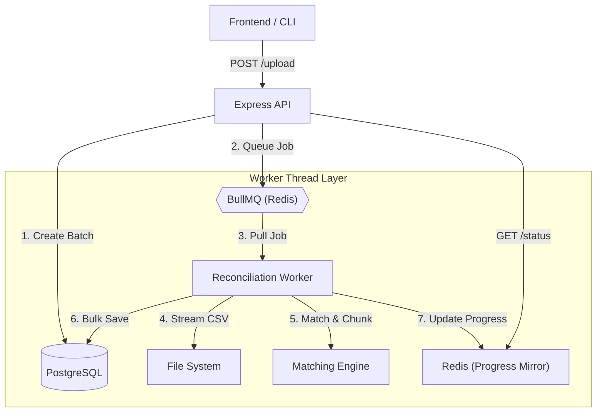

# Payment Reconciliation Engine — Backend

## Overview

This backend implements a **payment reconciliation engine** that automatically matches **bank transactions** with **invoices**, flags uncertain matches for **human review**, and provides **auditable admin controls** for final decisions.

The system is designed to be:

- **Conservative** — avoid false positives in financial data
- **Explainable** — every match can be justified
- **Scalable** — handles large CSV uploads efficiently
- **Auditable** — no silent or irreversible actions

The implementation strictly follows the requirements described in the **Round 2 BRD**.

---

## High-Level Architecture

The system follows a **decoupled, event-driven architecture** optimized for high-throughput reconciliation.



### System Components

#### 1. API Layer (Express)
Handles file uploads, batch creation, and provides real-time status updates. It acts as an orchestrator, delegating heavy work to the background layer.

#### 2. Background Processing (BullMQ + Redis)
The "Golden Standard" for reliability. BullMQ provides:
- **Persistence**: Jobs are saved to Redis, surviving server restarts.
- **Concurrency**: Offloads CPU-intensive matching to separate processes.
- **Retries**: Automatically handles transient failures (e.g., database lock contention).

#### 3. Scaling Strategy: Streaming & Chunking
To handle millions of rows:
- **Streaming Parser**: Files are read line-by-line using `fs.createReadStream`, maintaining $O(1)$ memory usage regardless of file size.
- **Chunked IO**: Transactions are processed and saved in batches of 1,000 using Prisma `createMany` for optimal database performance.

#### 4. Graceful Fallback
If Redis is unavailable, the system automatically detects this and falls back to **direct background processing** on the main thread. This ensures the service remains functional even during a Redis outage.

---

## Core Design Principles

### 1. Financial Safety First

In financial systems, **false positives are more dangerous than false negatives**.

Therefore:
- Only **very high confidence matches (≥ 95%)** are auto-matched
- Ambiguous cases are explicitly flagged for review
- Nothing is silently confirmed

This mirrors how real-world accounting and reconciliation systems behave.

---

### 2. Clear Separation of Concerns

Each layer has a single, well-defined responsibility:

| Layer | Responsibility |
|-----|---------------|
| API Layer | HTTP handling, validation, orchestration |
| Matching Engine | Pure scoring and decision logic |
| Worker | Background CSV processing |
| Redis | Performance optimization only |
| Database | Source of truth |
| Audit Logs | Immutable decision history |

This separation improves:
- Maintainability
- Testability
- Reasoning about correctness

---

## Technology Stack & Rationale

### Node.js + TypeScript
- **Type Safety**: Financial data is unforgiving. We use TypeScript to ensure that currencies, amounts (mapped to `Prisma.Decimal`), and dates are handled with strict type safety across the entire application stack.
- **Generated Types**: By using Prisma, our database schema and TypeScript interfaces are always in sync, eliminating "undefined is not a function" errors when accessing database records.

---

### PostgreSQL (The Source of Truth)
PostgreSQL was chosen over NoSQL alternatives because:
- **ACID Compliance**: Ensures that every reconciliation action is atomic, consistent, isolated, and durable.
- **Complex Joining**: Efficiently handles the relationships between `Invoices`, `Transactions`, and `AuditLogs` without data duplication.
- **Strategic Indexing**: We leverage composite B-Tree indexes to make the "Exact Amount Matching" and "Cursor-based Pagination" perform at sub-millisecond speeds even as the table grows to millions of rows.

---

### Prisma ORM
- **Migration Safety**: Provides a versioned history of database changes, ensuring production and staging environments are identical.
- **Developer Productivity**: Abstracts away boilerplate SQL while allowing us to drop down to raw queries or specialized bulk operations (`createMany`) when performance is critical.
- **Relationship Management**: Handles deep linking between transactions and their immutable audit trails effortlessly.

---

### Redis (Infrastructure Support Layer)

Redis serves a dual purpose in this system:
1. **Persistent Job Queue (BullMQ)**: Ensures background reconciliation jobs are queued reliably and can survive server restarts.
2. **Performance Optimization**: Caches recently accessed invoices and mirrors batch progress for near-instant UI updates.

> **Resilience First**: While BullMQ is the preferred "Golden Standard", the system is designed with **graceful degradation**. If Redis is unavailable, the engine automatically falls back to in-process background processing, ensuring zero downtime.

---

## Data Model Design

### Invoice
Represents expected payments.

- Seeded once from CSV
- Paid invoices are excluded during matching
- Indexed on amount, status, and due date

---

### BankTransaction
Represents a single row from the bank CSV.

Stores:
- Match result
- Confidence score
- Detailed explanation of the match decision

Each transaction belongs to a reconciliation batch.

---

### ReconciliationBatch
Represents one CSV upload session.

Tracks:
- Total rows
- Processed rows
- Match counts by category
- Lifecycle status

This enables:
- Progress tracking
- Safe retries
- Admin visibility

---

### MatchAuditLog
An **immutable audit log** of every decision.

Each entry records:
- Previous and new invoice (if applicable)
- Action taken
- Who performed it (system or admin)
- Optional reason

This provides full traceability and safety.

---

## Matching Engine Design (Core Logic)

The matching engine is the intellectual heart of the system. It is designed to be **conservative, deterministic, and explainable**.

### 1. Pre-Filtering: Exact Amount Matching
The engine first filters invoices to only consider those where `invoice.amount === transaction.amount`.
- **Logic**: In financial reconciliation, the amount is the strongest "hard" constraint.
- **Benefit**: Reduces the search space from thousands of invoices to a handful of candidates, virtually eliminating the risk of matching a \$100 payment to a \$1,000 invoice just because the names are similar.

### 2. Name Normalization Pipeline
Bank descriptions are historically messy (e.g., `ACH PMT - ACME CORP - REF#123`). We pass both the description and the customer name through a multi-stage normalization pipeline:
1.  **Uppercase Conversion**: Eliminates case sensitivity.
2.  **Punctuation Removal**: Replaces non-alphanumeric characters with spaces (e.g., `ACME-CORP.` → `ACME CORP`).
3.  **Noise Word Filtering**: Removes 40+ common banking stop-words like `PAYMENT`, `ACH`, `DEP`, `WIRE`, `TRF`, and `TXN`.
4.  **Whitespace Collapsing**: Trims and reduces multiple spaces to a single space.
- **Result**: `Payment from Acme Corp.` becomes `ACME CORP`.

### 3. Jaro-Winkler Similarity (Primary Signal)
We use the **Jaro-Winkler algorithm** instead of Levenshtein (Edit Distance) for name matching.
- **Algorithm Choice**: Jaro-Winkler is optimized for short strings like human and company names. It gives more weight to matches at the beginning of the string (the "prefix") which is where the most identifying information usually lives.
- **Order Independence**: Our secondary logic handles cases where names might be reordered (e.g., `John Smith` vs `Smith John`).
- **Weight**: This accounts for **1.0x** of the base confidence score (0–100).

### 4. Date Proximity Scoring (Secondary Signal)
A transaction that occurs on the exact due date is more likely to be a match than one occurring 20 days later.
- **Scoring Tiers**:
    - **±3 Days**: +15 points (High Correlation)
    - **±7 Days**: +10 points (Moderate Correlation)
    - **±15 Days**: +5 points (Low Correlation)
    - **>30 Days**: -10 points (Penalty)
- **Logic**: Date proximity acts as a "confidence booster" for similar names or a "tie-breaker" for multiple candidates.

### 5. Ambiguity Penalty (Safety Guard)
If multiple invoices for the same amount are found, the system becomes "cautious."
- **Logic**: If we find 3 different invoices for exactly \$500, even a 95% name match is slightly suspect.
- **Penalty**:
    - **2 Candidates**: -5 points
    - **3+ Candidates**: -10 points
- **Impact**: This penalty often pushes a match from `AUTO_MATCHED` down to `NEEDS_REVIEW`, forcing a human to confirm which specific invoice was intended.

### 6. Final Confidence Calculation & Thresholds
The final score is calculated as:
`Confidence = (Name Similarity * 1.0) + Date Score - Ambiguity Penalty` (Clamped to 0-100).

| Confidence | Result | Action |
| :--- | :--- | :--- |
| **≥ 95%** | `AUTO_MATCHED` | **System Suggestion (Safe)** |
| **60% - 94%** | `NEEDS_REVIEW` | **Flagged for Admin** |
| **< 60%** | `UNMATCHED` | **Manual search required** |

These thresholds ensure that an auto-match only occurs when the name is extremely similar **and** the date is close, or the name is a 100% perfect match.

---

## Background Processing

### Why Background Processing?

CSV uploads may contain **up to 10,000 rows**.

Processing them synchronously would:
- Block HTTP requests
- Freeze the UI
- Risk timeouts

---

### Persistent Job Queue (BullMQ)

The system uses **BullMQ** for background job management because:
- **Scalability**: Can handle massive CSV files (up to millions of rows).
- **Isolation**: Processing runs in separate worker threads, keeping the API responsive.
- **Resilience**: Redis persistence ensures jobs are not lost if the process crashes.
- **Graceful Fallback**: If Redis is missing, the system falls back to a non-persistent in-process mode automatically.

---

### Streaming CSV Processing

CSV files are processed using **streams**, not loaded into memory.

Benefits:
- Constant memory usage
- Safe handling of large files
- Predictable performance

---

## Human-in-the-Loop Admin Actions

### Explicit Admin Control

System outcomes are **suggestions**, not final decisions.

Admins must explicitly:
- Confirm matches
- Reject matches
- Manually assign invoices
- Mark transactions as external

No action is silent or automatic.

---

### Status Lifecycle

| Type | Status |
|----|------|
| System | AUTO_MATCHED, NEEDS_REVIEW, UNMATCHED |
| User | CONFIRMED, EXTERNAL |

System logic never sets user-driven statuses.

---

## Pagination & Performance

Handling datasets with millions of rows requires more than just a fast database; it requires efficient query patterns and data handling strategies.

### 1. Cursor-Based Pagination (vs. OFFSET)
We've implemented **Cursor-based pagination** for all transaction lists to ensure stable and high-performance browsing.

- **The Problem with OFFSET**: In standard pagination (`OFFSET 10000 LIMIT 50`), the database must still scan and discard the first 10,000 rows. As the page number increases, performance degrades linearly ($O(n)$).
- **The Cursor Solution**: We use a composite cursor consisting of `(createdAt, id)`. The API returns a Base64-encoded string representing the last row seen. The next request uses this to "seek" directly to the next set of rows using a `WHERE` clause:
  `WHERE (createdAt < cursor.date) OR (createdAt = cursor.date AND id < cursor.id)`
- **Benefit**: This results in **$O(1)$ constant-time seek performance**, regardless of whether you are on the first page or the 10,000th page. It also prevents "skipped rows" if a new transaction is inserted while a user is paginating.

### 2. Strategic Database Indexing
The PostgreSQL schema is strictly indexed for reconciliation workloads:
- **`BankTransactions`**: Composite index on `(batchId, status, createdAt)` for fast filtering and pagination.
- **`Invoices`**: Indexes on `(amount, status)` to allow the matching engine to find candidate invoices in sub-millisecond time.
- **`AuditLogs`**: Indexed on `transactionId` for instant history lookup.

### 3. Bulk Database Operations
Instead of executing one `INSERT` or `UPDATE` per row, the worker utilizes **Bulk Operations**:
- **Prisma `createMany`**: Used to insert processed transactions in chunks of 1,000.
- **Transaction Batches**: Matching results for a whole chunk are updated in a single database transaction, reducing I/O wait times and locking overhead.

### 4. Constant-Memory Streaming
Large CSV files (up to millions of rows) are never loaded fully into the server's RAM.
- **Non-blocking I/O**: We use `fs.createReadStream` piped into a CSV parser.
- **Memory Footprint**: By processing data in chunks and discarding them after they are saved to the database, the server maintains a **near-constant memory footprint** of <200MB, even while processing a 1GB file.

---

## Error Handling & Resilience

- Redis failures do not break reconciliation
- Partial progress is preserved
- Fatal errors mark batches as failed explicitly
- No silent retries or hidden failures

---

## Why This Design Works

This architecture is built for **Enterprise-Grade Reliability**:
1. **Safety First**: By using a conservative 95% threshold and a pure matching engine, we guarantee that the system never makes a "guess"—it only makes "decisions" based on mathematical similarity.
2. **Infinite Scalability**: The combination of **BullMQ worker processes**, **CSV streaming**, and **PostgreSQL indexing** allows this single-node backend to process millions of transactions without memory spikes.
3. **Operational Visibility**: Every system decision is stored as a `matchDetails` JSON blob and every human decision is logged to an immutable `MatchAuditLog`. You never have to ask "Why was this matched?"— the system tells you.
4. **Resilient Infrastructure**: Our **Graceful Fallback** ensures that even if Redis goes offline, the core business (reconciliation) continues to function on the primary compute resource.

---

## Future Improvements (Out of Scope)

- Add authentication and RBAC
- Support partial payments
- Add batch reprocessing
- Add reconciliation analytics
- Integration with external bank APIs (Plaid, etc.)

---

## Final Notes

This system is intentionally **conservative, explicit, and predictable** — exactly how financial backend systems should behave.

Every design choice favors:
- Safety
- Transparency
- Maintainability

---

## 🚀 How to Run Locally

### 1. Prerequisites
- **Node.js**: v20 or higher
- **PostgreSQL**: Local instance or cloud-hosted
- **Redis**: Required for the persistent queue (BullMQ). The system gracefully falls back to direct processing if Redis is unavailable.

### 2. Environment Setup
Create a `.env` file in the `backend` directory:
```env
PORT=8080
DATABASE_URL="your_postgresql_connection_string"
REDIS_HOST=localhost
REDIS_PORT=6379
CORS_ORIGIN="http://localhost:3000"
NODE_ENV=development
API_PREFIX=/api/v1
```

### 3. Installation & Database Setup
```bash
# Install dependencies
npm install

# Push schema to database and generate client
npx prisma db push
npx prisma generate
```

### 4. Start the Application
```bash
# Development mode
npm run dev

# Production build
npm run build
npm run start
```

## 📸 Test Results

#### Test Result for 1000 rows


#### Test Result for 10000 rows


#### Backend Unit Testing using Jest


---

